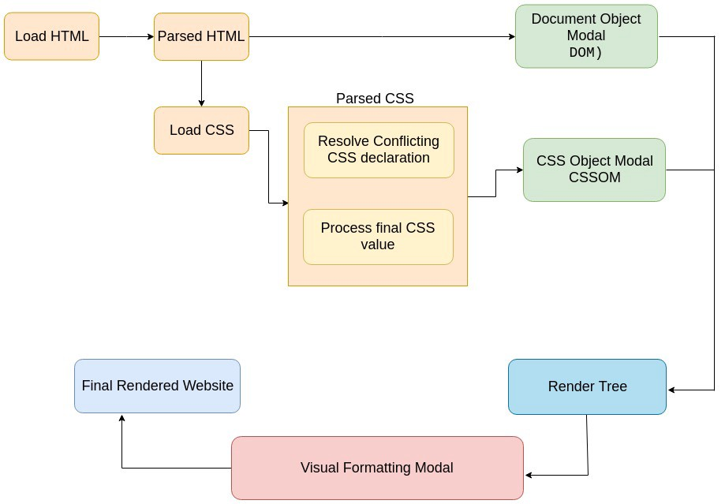

##### How does CSS actually work?
- When a browser starts to load the initial HTML file, it takes the loaded HTML code and parses it. builds the so-called DOM (Document Object Modal)
- As the browser parses the HTML, it also finds the stylesheets included in the HTML head and just like HTML, CSS is also parsed.
- two main steps that are performed during the CSS parsing phase
    1. Conflicting CSS declarations are resolved (also known a cascading)
    2. Process final CSS values (for eg- converting a margin defined in percentage units to pixels)
    - Parsed CSS is also stored in a tree-like structure called CSS Object Modal, similar to DOM.
- Both parsed HTML and CSS together form the so-called Render Tree (browser uses the constructed CSSOM and DOM to create a “render tree”. )
- Visual Formatting Model is used by the browser to actually render the page(algorithm that calculates the boxes(box-model))
    - Layout(browser draw CSS boxes)
    - paint
##### Critical Rendering Path
- The critical rendering path is the minimum steps that the browser has to take from the moment it receives the first byte of HTML to the moment that it renders pixels on the screen for the first time. 
1. Build the DOM (Document Object Model) from the recieved HTML
2. If we encounter a CSS style sheet (embedded or linked), start building the CSSOM 
3. If we encounter a JS block (not designated as async) while building the DOM, wait for CSSOM construction, stop DOM construction and parse/execute the code. 

